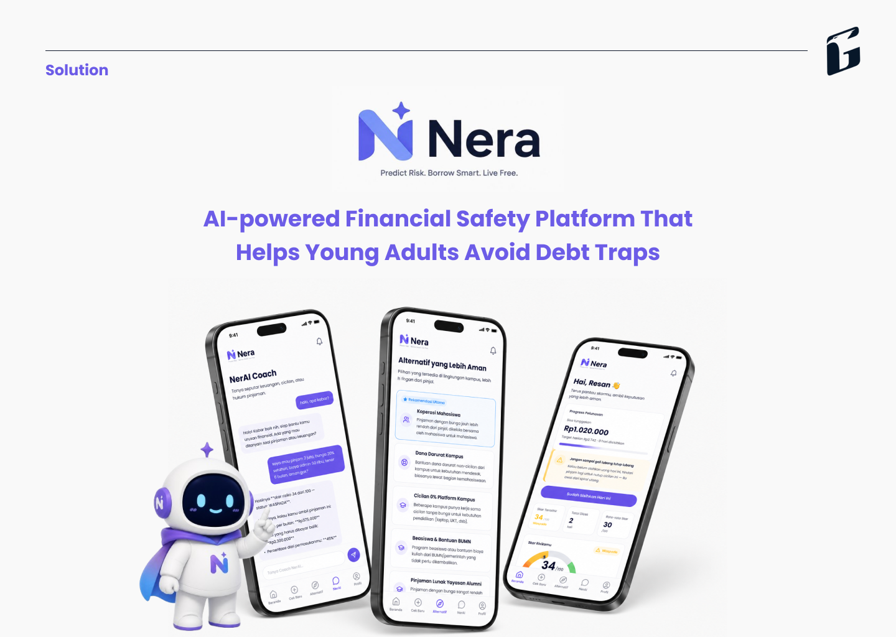

# `Nera`

**AI-powered Financial Safety Platform That Helps Young Adults Avoid Debt Traps**

---

## Team

| **Name**                      | **Role**                 |
| ----------------------------- | ------------------------ |
| Adrian Putra Pratama Badjideh | Lead, Product            |
| Resan So                      | Mobile Developer & UI/UX |
| Muhammad Karov Ardava Barus   | AI Engineer              |

---

## 1. Problem: The Predatory Lending Trap

In modern digital economies, users often fall into high-risk borrowing scenarios (like toxic online loans) due to a lack of financial oversight. The main obstacle is the absence of early detection systems that warn users before they make fatal financial commitments. **Nera** exists to democratize financial safety through an intelligent and proactive infrastructure.

## 2. Solution: Edge AI & Smart Decision Support

**Nera** is a premium mobile solution that combines financial intelligence with state-of-the-art AI technology:

- **Privacy-First Architecture:** All AI inference for threat detection runs locally on the device (Edge Computing), ensuring sensitive notification data is never sent to the cloud.
- **Automated Risk Profiling:** Calculates a Survival Check score to determine the exact threshold of a user's safe leverage.
- **Micro-Scholarship Engine:** An automated engine that queries and processes accessible funding alternatives to minimize toxic loan dependency.

## 3. Tech Stack & Engineering Excellence

We use a monorepo architecture optimized for a seamless end-to-end ecosystem:

| Component       | Technology              | Role                                                         |
| :-------------- | :---------------------- | :----------------------------------------------------------- |
| **Mobile App**  | **Expo (React Native)** | Premium cross-platform UI/UX with smooth interactions.       |
| **Backend**     | **Next.js 14**          | Analytical dashboard and asynchronous REST APIs.             |
| **AI Engine**   | **ONNX Runtime**        | Embedded `.onnx` model (threat_detection) running on-device. |
| **API Layer**   | **tRPC**                | Type-safe APIs bridging the client and server.               |
| **Database**    | **Prisma ORM & SQLite** | Reliable relational database blueprints.                     |
| **E2E Testing** | **Maestro**             | Automated UI workflows simulating live borrowing scenarios.  |

## 4. Key Features

### A. Edge AI Threat Detection

Instantaneous risk classification and predictive anomalies that detect aggressive loan communication patterns directly from Android notifications using a local `.onnx` model.

### B. Safety Dashboard & Survival Check

Comprehensive score assessment determining the exact threshold of a user's safe leverage and overall financial health.

### C. AI Decision Support

Integration with a smart automated Next.js/tRPC analytical backend to query alternative financial relief options.

### D. Micro-Scholarship Scraper

Automated engine that queries and processes accessible funding alternatives to minimize dependency on high-interest loans.

## 5. Getting Started (Local Development)

### Backend:

1. `cd backend`
2. `cp .env.example .env`
3. `npm install`
4. `npx prisma db push`
5. `npm run dev`

### Mobile App:

1. `cd mobile-app`
2. `npm install`
3. `npx expo start`
